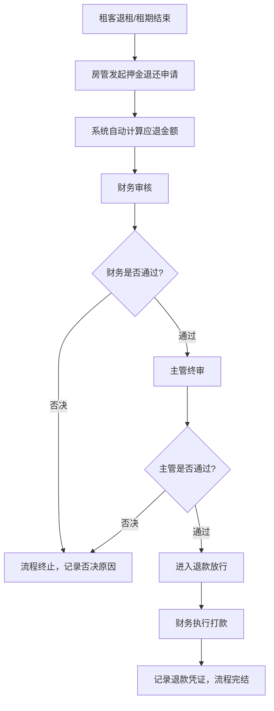
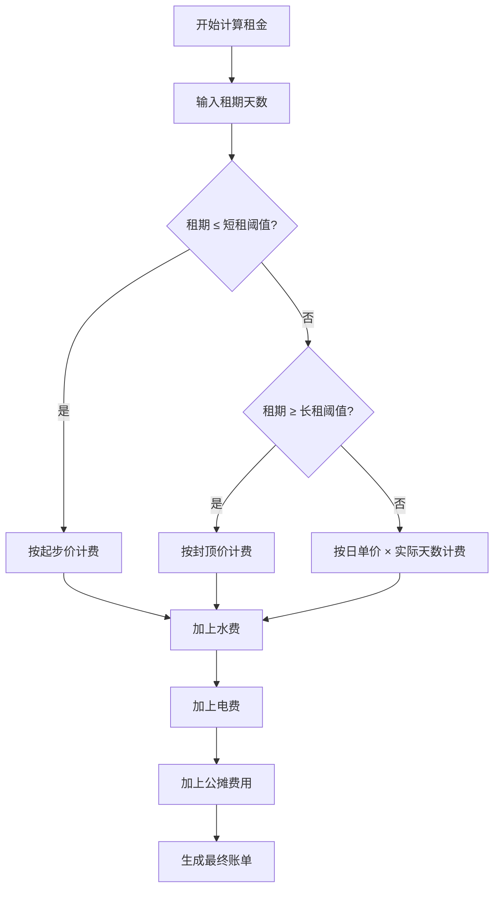

## 1. 产品概述
长租公寓收租管理系统，专为公寓运营方打造的一站式收租管理平台，解决租金精准计算、账单自动生成、押金多人会签审批、退款放行全流程管理的业务痛点。
- 核心价值：实现租金标准化计费、多人审批合规化、财务管理透明化，提升长租公寓运营效率与风险管控能力。
- 目标用户：公寓房管人员、财务人员、运营主管、系统管理员。

## 2. 核心功能

### 2.1 用户角色
| 角色 | 注册方式 | 核心权限 |
|------|----------|----------|
| 房管 | 后台开通 | 录入租客信息、发起押金退还申请、查看租金账单 |
| 财务 | 后台开通 | 审核账单、参与押金会签、执行退款操作、配置计费规则 |
| 主管 | 后台开通 | 最终审批押金退款、查看运营数据报表、配置系统参数 |
| 管理员 | 后台开通 | 用户管理、角色权限分配、全功能操作 |

### 2.2 功能模块
1. **租金计算模块**：计费规则配置、起步价计算、封顶价拦截、租期档位判定、水电分摊计费
2. **账单生成模块**：账单列表展示、账单详情查看、账单状态跟踪、水电费用明细
3. **押金会签模块**：会签申请发起、多人会签收集、审批进度追踪、全票通过判定、一票否决终止
4. **退款放行模块**：退款审核、退款执行、退款记录、放款确认

### 2.3 页面详情
| 页面名称 | 模块名称 | 功能描述 |
|-----------|-------------|---------------------|
| 仪表盘 | 数据概览 | 展示当月应收、已收、待收金额，押金审批进度，关键指标卡片 |
| 租金计算 | 计费规则配置 | 设置起步价、封顶价、短租/长租阈值、水电单价、公摊比例等参数 |
| 租金计算 | 租金试算 | 输入租期、面积、水电用量，实时计算展示租金明细与总额 |
| 账单管理 | 账单列表 | 展示所有账单，支持筛选、搜索、导出，显示账单状态 |
| 账单管理 | 账单详情 | 展示账单明细，包含基础租金、水费、电费、公摊费用 |
| 押金会签 | 会签申请列表 | 展示所有押金退还申请，状态筛选，发起人、金额、审批进度 |
| 押金会签 | 会签详情 | 展示申请详情、租客信息、押金金额、各审批人意见与状态、操作按钮 |
| 退款放行 | 退款列表 | 展示已通过会签的退款申请，执行退款操作，记录退款凭证 |
| 退款放行 | 退款详情 | 展示退款完整信息，包含会签记录、打款信息、操作日志 |

## 3. 核心流程
租客退租时，房管发起押金退还申请，系统自动计算应退押金金额（扣除欠费、违约金等），随后进入多人会签流程：房管提交 → 财务审核 → 主管终审。任一人否决则流程终止并记录原因；全部通过后进入退款放行环节，财务执行打款操作并记录凭证。

租金计算流程：系统根据租期判定短租/长租，短租按起步价计费，长租按封顶价计费，中间租期按日单价×天数计算，最后叠加水电公摊费用生成账单。

## 4. 用户界面设计

### 4.1 设计风格
- 主色调：深青色 #0D4F4F 搭配金色 #C9A962，传达专业、稳重、可信赖的金融属性
- 辅助色：浅灰 #F5F6F8 作背景，深灰 #2C3E50 作文字，绿色 #27AE60 表通过，红色 #E74C3C 表否决
- 按钮风格：圆角6px，主按钮深青色配金色文字，悬停微上浮阴影效果
- 字体：标题使用思源宋体加粗增强品质感，正文使用思源黑体保证可读性
- 布局风格：左侧导航栏+顶部状态栏+右侧内容区的经典后台布局，卡片式模块展示
- 图标风格：线性图标，统一2px描边，金色图标点缀关键操作

### 4.2 页面设计概览
| 页面名称 | 模块名称 | UI元素 |
|-----------|-------------|-------------|
| 仪表盘 | 数据概览 | 4个核心指标卡片（渐变色背景）、会签进度环形图、近期账单列表、动效数字滚动 |
| 租金计算 | 计费规则配置 | 表单卡片布局，分组折叠面板，实时预览计算结果，滑杆调节参数 |
| 租金计算 | 租金试算 | 左侧输入表单，右侧实时计算结果卡片，费用明细展开动画 |
| 账单管理 | 账单列表 | 数据表格，状态标签彩色区分，行悬停高亮，批量操作工具栏 |
| 押金会签 | 会签详情 | 时间线式审批流程展示，审批人头像与状态，同意/否决操作按钮放大突出 |
| 退款放行 | 退款列表 | 状态徽章，打款状态进度条，操作列含复制凭证号功能 |

### 4.3 响应式
- 桌面端优先设计（≥1280px），三栏布局完整展示
- 平板端（768px-1279px）：左侧导航收起为图标模式，内容区自适应
- 移动端（<768px）：顶部汉堡菜单，卡片纵向堆叠，表格转卡片列表展示

### 4.4 视觉动效
- 页面加载：元素错落淡入（staggered fade-in），导航栏从左滑入
- 数据卡片：悬停微上浮+阴影加深，数字滚动动画
- 会签审批节点：通过时绿色勾选动画，否决时红色震动提示
- 表单提交：按钮loading态旋转动画，成功后绿色对勾弹出
