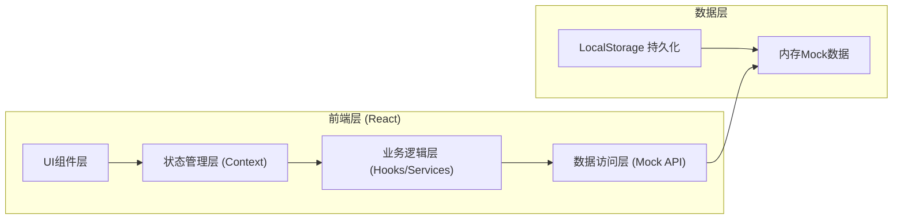
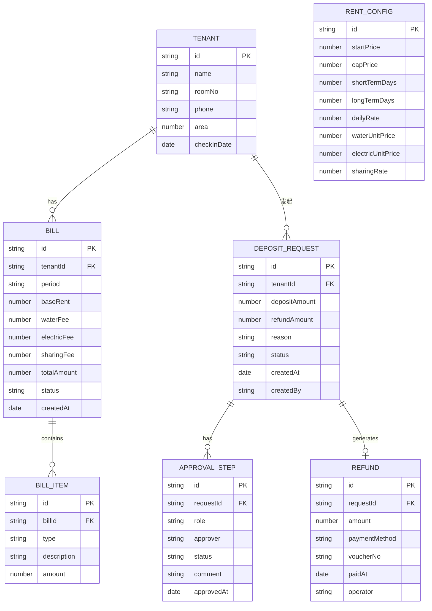

## 1. 架构设计



## 2. 技术描述
- 前端：React@18 + TypeScript + tailwindcss@3 + vite
- 初始化工具：vite-init
- 后端：无后端，使用Mock数据 + LocalStorage模拟持久化
- 状态管理：React Context + useReducer
- 路由：React Router v6
- 图标：Lucide React
- 数据持久化：LocalStorage

## 3. 路由定义
| 路由 | 页面组件 | 用途 |
|-------|---------|------|
| /dashboard | Dashboard | 数据概览仪表盘 |
| /rent/calculator | RentCalculator | 租金计算与试算 |
| /rent/config | RentConfig | 计费规则配置 |
| /bills | BillList | 账单列表 |
| /bills/:id | BillDetail | 账单详情 |
| /deposit | DepositApprovalList | 押金会签申请列表 |
| /deposit/:id | DepositApprovalDetail | 押金会签详情与审批 |
| /refund | RefundList | 退款放行列表 |
| /refund/:id | RefundDetail | 退款详情 |

## 4. 数据模型

### 4.1 数据模型定义



### 4.2 核心数据结构

```typescript
// 租客信息
interface Tenant {
  id: string;
  name: string;
  roomNo: string;
  phone: string;
  area: number;
  checkInDate: string;
}

// 计费规则配置
interface RentConfig {
  id: string;
  startPrice: number;      // 起步价（短租）
  capPrice: number;        // 封顶价（长租）
  shortTermDays: number;   // 短租阈值（天）
  longTermDays: number;    // 长租阈值（天）
  dailyRate: number;       // 日单价
  waterUnitPrice: number;  // 水单价（元/吨）
  electricUnitPrice: number; // 电单价（元/度）
  sharingRate: number;     // 公摊比例（%）
}

// 租金计算结果
interface RentCalculationResult {
  rentDays: number;
  baseRent: number;
  pricingTier: 'short' | 'medium' | 'long';
  waterFee: number;
  electricFee: number;
  sharingFee: number;
  totalAmount: number;
  breakdown: {
    description: string;
    amount: number;
  }[];
}

// 账单
interface Bill {
  id: string;
  tenantId: string;
  tenantName: string;
  roomNo: string;
  period: string;
  baseRent: number;
  waterFee: number;
  waterUsage: number;
  electricFee: number;
  electricUsage: number;
  sharingFee: number;
  totalAmount: number;
  status: 'pending' | 'paid' | 'overdue';
  createdAt: string;
}

// 押金退还申请
interface DepositRequest {
  id: string;
  tenantId: string;
  tenantName: string;
  roomNo: string;
  depositAmount: number;
  refundAmount: number;
  deductionReason: string;
  reason: string;
  status: 'pending_finance' | 'pending_manager' | 'approved' | 'rejected';
  createdAt: string;
  createdBy: string;
  steps: ApprovalStep[];
}

// 审批步骤
interface ApprovalStep {
  id: string;
  role: 'house_manager' | 'finance' | 'manager';
  roleName: string;
  approver: string;
  status: 'pending' | 'approved' | 'rejected';
  comment: string;
  approvedAt: string | null;
}

// 退款记录
interface Refund {
  id: string;
  requestId: string;
  tenantName: string;
  amount: number;
  paymentMethod: 'bank_transfer' | 'alipay' | 'wechat' | 'cash';
  voucherNo: string;
  paidAt: string;
  operator: string;
  status: 'pending' | 'completed';
}
```

## 5. 核心业务逻辑

### 5.1 租金计算算法
```
输入：租期天数(days), 用水吨数(water), 用电度数(electric), 面积(area)
输出：总租金及明细

1. 基础租金计算：
   - 若 days ≤ shortTermDays → baseRent = startPrice (短租起步价)
   - 若 days ≥ longTermDays → baseRent = capPrice (长租封顶价)
   - 否则 → baseRent = dailyRate × days (中间档位按日计算)

2. 附加费用：
   - waterFee = water × waterUnitPrice
   - electricFee = electric × electricUnitPrice
   - sharingFee = (waterFee + electricFee) × (sharingRate / 100)

3. 总金额：
   - totalAmount = baseRent + waterFee + electricFee + sharingFee
```

### 5.2 多人会签判定算法
```
输入：审批步骤列表(steps)
输出：整体审批状态

1. 任一审批步骤 status === 'rejected' → 整体状态 = 'rejected'（一票否决）
2. 所有审批步骤 status === 'approved' → 整体状态 = 'approved'（全票通过）
3. 否则 → 整体状态为下一待审批角色
```
